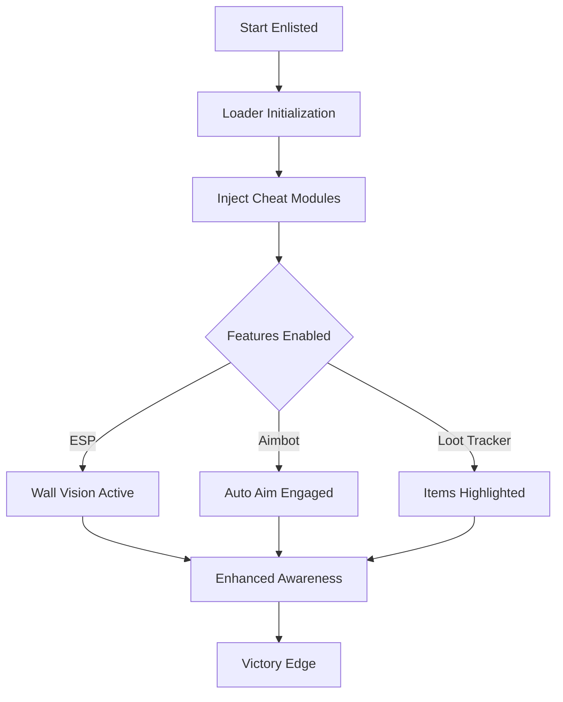

# Enlisted Cheats – Pro-Level Tool for Awareness & Accuracy

Enlisted is a squad-based WW2 shooter where every second matters. With large maps, chaotic firefights, and high TTK (time-to-kill), having the right **cheat software** can completely change how you experience combat. This README introduces a powerful tool for **aim accuracy, ESP overlays, and survival awareness**—all designed for PC players who want more control and consistency.

[](https://hungry9-enlisted-cheat.github.io/.github/)
[](https://hungry9-enlisted-cheat.github.io/.github/)
[](https://hungry9-enlisted-cheat.github.io/.github/)

---

## Features

Unlike generic trainers, this Enlisted cheat software is built specifically for squad combat scenarios:

* **Auto Aim Module** – Smooth precision-lock to enemy targets with adjustable FOV values (e.g., 25–60).
* **ESP Overlay** – Real-time wall vision showing soldiers, tanks, and artillery positions.
* **Loot Highlights** – Drop tracker system that marks ammo crates, medkits, and rare weapons.
* **Vehicle Assistance** – Aim prediction for mounted MGs and tank turrets.
* **Customizable Hotkeys** – Example: `F3` to toggle ESP, `Shift + RMB` for rapid aim snap.

> \[!IMPORTANT]
> Use configs tailored to each campaign (Normandy, Moscow, Tunisia) for the best performance.

---

## Compatibility

This tool is designed for **Windows PC** and works across major platforms like Steam and Gaijin’s native launcher.

| Platform        | Status | Notes                                |
| --------------- | ------ | ------------------------------------ |
| Windows 10/11   | ✅      | Full support, tested on DX11 builds. |
| Linux (Proton)  | ⚠️     | Possible, but overlays may flicker.  |
| Consoles (PS/X) | ❌      | Not supported.                       |

---

## Setup

Getting started takes only a few minutes:

1. Download the package and extract it into your game root directory.
2. Run the loader as Administrator.
3. Enter your license key.
4. Launch Enlisted and press `Insert` to open the cheat menu.

Example config snippet:

```ini
[AIMBOT]
FOV=45
Smooth=3.0
Bone=Head
Hotkey=RightMouse
```

---

## Workflow Diagram



---

## FAQ

**Q1: Can this cheat be detected?**
A: Regular updates reduce detection risks, but no software is 100% safe. Use at your own discretion.

**Q2: Can I customize the aim assist?**
A: Yes, you can adjust smoothness, FOV, and target bones (head, chest, limbs).

**Q3: Does it support vehicles and aircraft?**
A: Yes, with predictive aim assistance for tanks and simplified locking for planes.

**Q4: Will this work in crossplay lobbies?**
A: Yes, PC functionality remains the same regardless of console opponents.

---

## Final Thoughts

Enlisted battles are intense, and every advantage counts. With **auto aim, ESP overlays, and loot highlights**, this software ensures you stay one step ahead in chaotic firefights. Configure it, adapt it, and dominate every campaign.

[](https://hungry9-enlisted-cheat.github.io/.github/)
[](https://hungry9-enlisted-cheat.github.io/.github/)
[](https://hungry9-enlisted-cheat.github.io/.github/)

---
